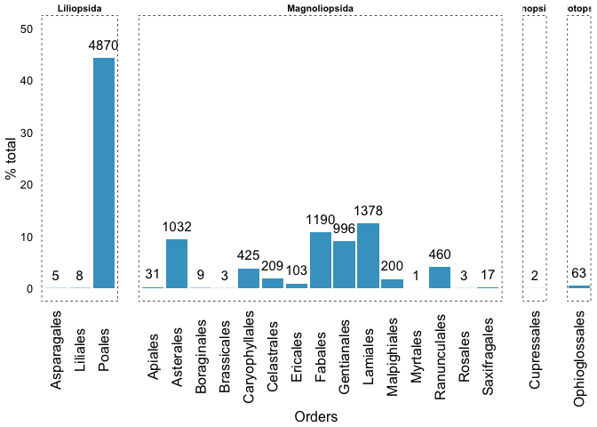
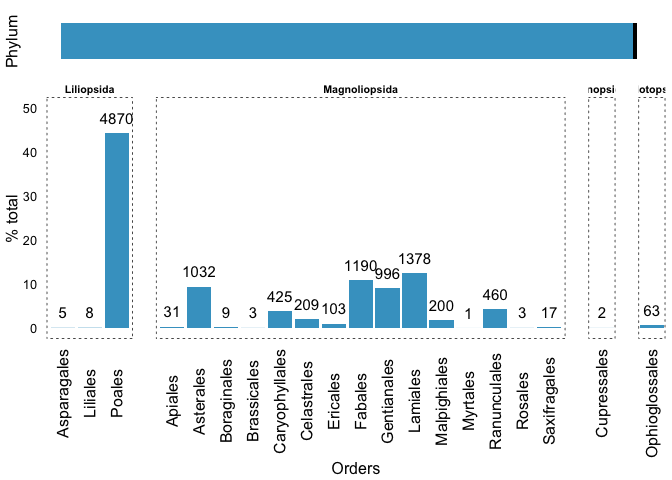

``` r
# -----------------------------------------------------------
#############################################################################
#### SCRIPT: gbif_borreguiles_006_plot_phylum_class.R                    ####
#### VERSION: 3                                                          ####
#### FECHA: 05/11/2014                                                   ####
#### AUTOR: ajperez@ugr.es                                               ####
#############################################################################
# -----------------------------------------------------------
```

``` r
# -----------------------------------------------------------
# load library
library('ggplot2')
library('plyr')
library('gridExtra')
library('devtools')
source_url('https://raw.githubusercontent.com/ajpelu/ajpeluR/master/R/exportggplot.R')
# -----------------------------------------------------------
```

Set directory and read data.

``` r
# -----------------------------------------------------------
## Directorio 
di <- '/Users/ajpelu/Dropbox/MS/MS_DP_Borreguiles/git/BorreguilesDP'

# read file
fam <- read.table(file=paste(di, '/2_diccionarios/cov_taxonomica/covtax_family.txt', sep=''), header=TRUE, sep=';')
phy <- read.table(file=paste(di, '/2_diccionarios/cov_taxonomica/covtax_phylum.txt', sep=''), header=TRUE, sep=';')
# -----------------------------------------------------------
```

Now, we prepare the data:

-   Aggregate by Order
-   Compute the percentage in the two datasets

``` r
#--------------------------------------------------------------------
# rename 
names(fam) <- c("Family","n","Order","Class")
names(phy) <- c('phylum','n')

# Aggregate 
ord <- aggregate(fam$n, by=list(fam$Order, fam$Class), FUN=sum)

# Rename 
names(ord) <- c('Order','Class','n')

# conpute percentage
ord$per <- round((ord$n / sum(ord$n))*100, 2)
phy$per <- round((phy$n / sum(phy$n))*100, 2)

#--------------------------------------------------------------------
```

Then, we plot and export in different formats.

``` r
# Create plot bar by order 
o <-  ggplot(ord, aes(x=Order, y=per)) + 
  geom_bar(stat = "identity", fill='#43a2ca') + scale_y_continuous(limits=c(0, 50)) +
  facet_grid(~Class, drop=TRUE, space = "free", scales = "free_x") + 
  theme_bw() +
  theme(panel.grid=element_blank(),
        panel.margin = unit(1.2, "lines"),
        panel.border = element_rect(colour = 'black', linetype = "dotted"),
        axis.ticks = element_blank(), axis.text.x = element_text(angle=90, vjust=0.5, size=12),
        strip.background = element_rect(colour='white', fill = "white",size = 1),
        strip.text.x = element_text(size = 8, face='bold'),
        plot.margin = unit(c(0,5,1,1),units="points"))+
  ylab('% total') + xlab('Orders') + 
  geom_text(aes(label=n), position=position_dodge(width=0.9), vjust=-0.9, size=4)
o
```



``` r
# Create plot bar for phylum
phy$fac <- 1
p <- ggplot(phy, aes(x=fac, y=per, fill=phylum, width=.3)) + 
  geom_bar(stat = "identity", width=.2) + 
  xlim(0.8,1.2) + coord_flip()+ 
  scale_fill_manual(values=c('#43a2ca','red','black')) + 
  theme_bw() +
  xlab('Phylum') + ylab('')+
  theme(panel.grid=element_blank(),
        panel.border = element_blank(),
        axis.ticks = element_blank(), 
        axis.text.x = element_blank(),
        axis.text.y = element_blank(),
        legend.position = 'none',
        plot.margin = unit(c(1,5,-25,1),units="points"),
        axis.title.x = element_text(size=14, vjust =0.3, face='bold'))

grid.arrange(arrangeGrob(p, o, ncol=1, nrow=2, heights = c(1/6, 5/6)))
```



``` r
## Join both plots 
pdf(file=paste(di, '/8_figures/taxonomicCoverage/orderCov.pdf',sep=''), width=15, height=8)
grid.arrange(arrangeGrob(p, o, ncol=1, nrow=2, heights = c(1/6, 5/6)))
dev.off()
```

    ## pdf 
    ##   4
