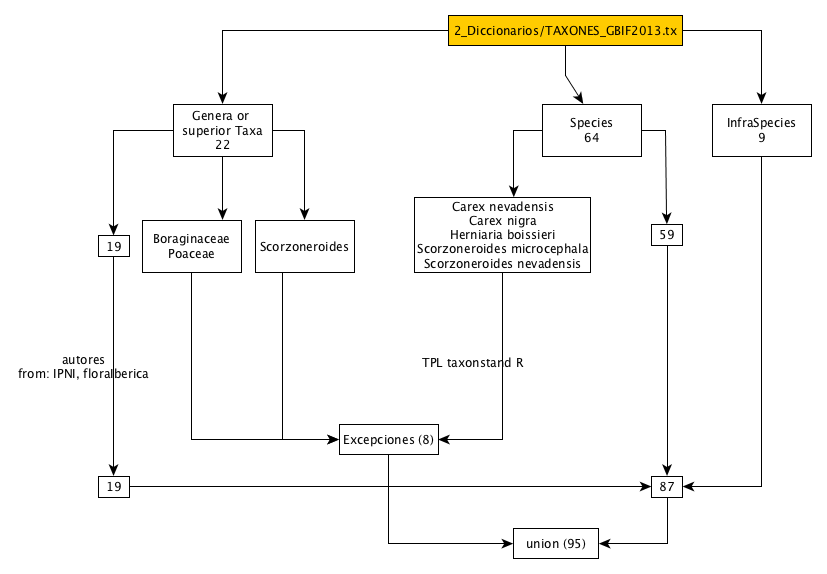
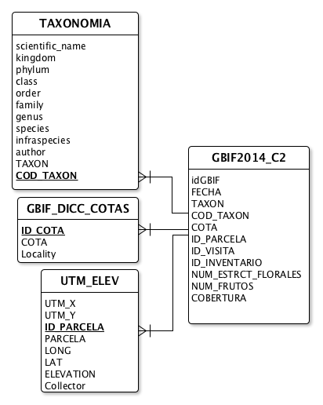

## Creación de la vista (sql) de DWC-A de borreguiles

### Versión de la BD 
* Versión: BD_borreguiles_v5.9_20141103.mdb 
* path: `./BorreguilesDP/1_bd/BD_borreguiles_v5.9_20141103.mdb`
* La llamaremos *BD_obsnev*

Para esta consulta consideramos una ocurrencia: *un taxon es observado en un plot y anotado en una fecha concreta* 

### Consultas a la BD_obsnev 
Creamos varias consultas sobre la BD_obsnev (la que está en linaria) para poder generar una vista DWC-A. A estas consultas las  llamaremos: 

* GBIF2014_C1 

##### GBIF2014_C1 
* Esta consulta parte de la tabla `TABL_INVENTARIO` 
* Sobre ella creamos una consulta, con la restricción de que el campo taxón sea no nulo (`TABL_INVENTARIO.COD_TAXON>0`)
* Creamos un indentificador para cada registro de la consulta, de forma que sea unívoco. Hemos generado un código o clave que es combinación de varios identificadores: ***BORREG-000-XXXXXX-AAAAAAAAA***
	* ***BORREG*** es el nombre de la metodología
	* ***000*** corresponde al *ID_PARCELA*
	* ***XXXXXX*** corresponde al *ID_VISITA*
	* ***AAAAAAAAA*** corresponde al *ID_INVENTARIO*
	* idGBIF: `'BORREG' & '-' & Format( [ID_PARCELA] ; "000") & '-' & Format ( [ID_VISITA] ; "000000") & '-' & Format( [ID_INVENTARIO] ; "000000000")`  
* El código `sql` se puede encontrar en `./3_scripts/sql/gbif2014_c1.sql`
* La consulta de creación de tabla no se puede desbloquear por lo que exportarmos la consulta como excel: `./2_diccionarios/gbif2014_c1.xlsx`
* Se genera una tabla con 11004 registros (04/11/2014)


##### GBIF2014_C2 
* Para cada ocurrencia tengo que asociaciar, si la tiene, la cobertura estimada del taxon para cada parcela 
* La base de esta consulta es la consulta anterior *GBIF2014_C1* 
* El código `sql` se puede encontrar en `./3_scripts/sql/gbif2014_c2.sql`
* La consulta de creación de tabla no se puede desbloquear por lo que exportarmos la consulta como excel: `./2_diccionarios/gbif2014_c2.xlsx`
* Se genera una tabla con 11005 registros (04/11/2014)

### Creación de base de datos de borreguiles para generar SQL view
* Creamos una bd con el nombre gbif2014_borreguiles en `./1_bd/gbif2014_borreguiles.mdb` 
* Importamos `./2_diccionarios/gbif2014_c2.xlsx` a la base de datos 

#### Cotas 
* Creamos una tabla (diccionario de cotas): GBIF_DICC_COTAS 
* Campos
	* ID_COTA: 1, 2, 3
	* COTA: 'Alta', 'Media', 'Baja'
	* Locality: 'Hoya del Moro (Bco. San Juan)', 'Hoya del Moro (Bco. San Juan)', 'Prado la Mojonera (Bco. San Juan)'
* 

#### Taxones 
* ***1)*** Consultar las entidades taxonomicas 
	* Llamar a la consulta *AgrupaTaxones*. Se trata de una consulta que lista todos los taxones existentes. 	 
	* El código `sql` se puede encontrar en `./3_scripts/sql/gbif2014bd_agrupa_taxones.sql`
	* Consulta de creación de tabla ***TAXONES*** (95 entidades taxonomicas, 04/11/2014)
	* Exportamos la tabla como `./2_diccionarios/TAXONES_GBIF2014.txt` 

A continuacion ejecutamos el script `./3_scripts/r/gbif_borreguiles_002_taxonomia.R` ([enlace](https://github.com/ajpelu/BorreguilesDP/blob/master/3_scripts/r/gbif_borreguiles_002_taxonomia.md)). Este script realiza los siguientes pasos: 

* Lee los archivos 
	* de los taxones `./2_diccionarios/TAXONES_GBIF2014.txt`  
	* de la base de datos de [Species2000](http://www.gbif.es/recursos1.php) en esta [url](http://iecolab.es/datasets/Species2000_IPNI_ANTHOS_Plant_Names_LSID_GBIF_2012.txt) `http://iecolab.es/datasets/Species2000_IPNI_ANTHOS_Plant_Names_LSID_GBIF_2012.txt` 
* A continuacion desagregamos los nombres cientificos de los taxones  en genus, species e infraspecies. 
* Creamos dataframes de generos, especies e infraespecies. Para cada dataframe consultamos la base de datos Species2000 y obtenemos los nombres completos de los taxones. También hacemos uso de los paquetes `taxize` ([Chamberlian and Szocs 2013](http://cran.r-project.org/web/packages/taxize/index.html)) y Taxonstand ([Cayuela and Oksanen 2014](http://cran.r-project.org/web/packages/Taxonstand/index.html))

Un esquema de la validación: 


* De este script se obtiene una tabla con los nombres de los taxones y todos sus atributos taxonomicos (phylum, class, etc.) que se exporta como `./2_diccionarios/TAXONES_GBIF2014_completos.txt`
* Esta tabla `./2_diccionarios/TAXONES_GBIF2014_completos.txt` la importamos a la base de datos `gbif2014_borreguiles` y la renombramos como `TAXONOMIA`. Ojo con los valores 'NA' (hay que reemplazarlos
##### Obtener el numero de registros por entidad taxonomica y año 
* Se trata de analizar los taxones por year. Esto nos sirve para ver que taxones se han visto mas y aquellos que son raros. 
* Hemos creado un script en `./3_scripts/r/gbif_borreguiles_004_observ_taxon_year.R` ([enlace](https://github.com/ajpelu/BorreguilesDP/blob/master/3_scripts/r/gbif_borreguiles_004_observ_taxon_year.md))
* La lista de taxones (95 taxones, 04/11/2014) está en: `./2_diccionarios/taxones_year.csv` 
 


#### Spatial Coverage 
##### UTM 
Hemos creado un diccionario de parcelas (`./2_diccionarios/spatial_coverage/dicc_parcelas_gbif.xlsx`), procedentes de varias fuentes: 

* BD_obsnev  
* Archivos vectoriales de las parcelas (shapes de Teresa Carreto) 
* Faltan los datos de RZ de las parcelas de la época de los 90 (??) 

Posteriormente hemos convertido las coordenadas de UTM a lat/long. Para ello hemos utilizado el script `./3_scripts/r/gbif_borreguiles_001_coordenadas.R` ([enlace](https://github.com/ajpelu/BorreguilesDP/blob/master/3_scripts/r/gbif_borreguiles_001_coordenadas.md))

##### Elevation
* Para conseguir la elevación utilizamos el tool `Extract to values points` (ArcMap)
* Utilizamos como capa de elevación el raster `mde_snev` (medio biofisio; relieve; CMA)
* Genero una capa vectorial de puntos (`./4_geoinfo/elevacion_coordenadas.shp` ) y la exporto en formato *.csv* (`./2_diccionarios/spatial_coverage/coordenadas_convertidas_elevacion.csv`)

A continuación importo las coordenadas y la elevación a la base de datos `gbif2014_borreguiles.mdb` con el nombre de tabla `UTM_ELEV`. 

Por otro lado, respecto a los campos municipio, provincia y localidad, tenemos los siguientes datos: 

| Cota  | Localidad                         | Municipio     | Provincia |
|-------|-----------------------------------|---------------|-----------|
| Alta  | Hoya del Moro (Bco. San Juan)     | GUEJAR-SIERRA | GR        |
| Media | Hoya del Moro (Bco. San Juan)     | GUEJAR-SIERRA | GR        |
| Baja  | Prado la Mojonera (Bco. San Juan) | GUEJAR-SIERRA | GR        |

 
#### Collector 
En la tabla `UTM_ELEV` se ha creado un campo (`Collector`) en función de la parcela para identificar a los colectores. Así las parecelas RZ el colector es Regino Zamora y en las demás he puesto a CP Sánchez Rojas. 

#### Variables 
Se crea en la base de datos gbif2014_borreguiles una tabla diccionario para las variables floración, fructificación, etc. La tabla (`DICC_VARIABLES`) tiene la siguiente estructura: 

* `Id`: idenfiticador
* `nombre`: nombre que le damos a la variable
* `precision`: campo a incluir con la precisión de la variable (ver campos *Measurement or Fact* de *DarwinCore*)
* `unidad`: unidad de la variable. 
* `metodo`: método utilizado para obtener la variable 
* `COD_VARIABLES`: códibo de la variable procedente de la base de datos original de borreguiles (`BD_obsnev`)

| Id | nombre        | precision | unidad                        | metodo                                                                                                                                                                                                    | COD_VARIABLES       |
|----|---------------|-----------|-------------------------------|-----------------------------------------------------------------------------------------------------------------------------------------------------------------------------------------------------------|---------------------|
| 1  | flowering abundance | 1         | number of flowering individuals by square meter |  count of flowering individuals                                                                                                                                                                                                        | NUM_ESTRCT_FLORALES |
| 2  | fruit abundance  | 1         | number of individuals in fruiting period by square meter  |  count of individuals in fruiting period                                                                                                                                                                                                         | NUM_FRUTOS          |
| 3  | cover         | 0.1     | percentage                    | Braun-Blanquet (1946) transformation of Braun-Blanquet cover-abundance scale. More info: Van der Maarel (2007) DOI: 10.1111/j.1654-1103.2007.tb02592.x  and Van der Maarel (1979) DOI: 10.1007/BF00052021 | COBERTURA           |


## Creación de las consultas SQL para generar el formato Dwc 
### Ocurrences 
Para generar esta consulta tenemos que establecer relaciones entre las diferentes tablas que integran la base de datos `gbif2014_borreguiles`. En el siguiente esquema se muestran las relaciones establecidas 



Para conseguir la tabla de Ocurrences ejecutamos una consulta (El código `sql` se puede encontrar en `./3_scripts/sql/genera_Occurences.sql` que la llamaremos `GeneraOcurrences` y que creará la tabla `Ocurrences`. A continuación mostramos el código: 

```sql 
SELECT 
  Year(Now()) & '-' & Format(Month(Now()),'00') & '-' & Format(Day(Now()),'00') & 'T' & DateAdd("h",-1,Time()) & 'Z' AS DateLastModified, 
  'OBSNEV' AS InstitutionCode, 
  'BORREGUILES' AS CollectionCode, 
  GBIF2014_C2.idGBIF AS CatalogNumber, 
  TAXONOMIA.scientific_name AS ScientificName, 
  'humanObservation' AS BasisOfRecord, 
  TAXONOMIA.kingdom AS Kingdom, 
  TAXONOMIA.phylum AS Phylum, 
  TAXONOMIA.class AS Class, 
  TAXONOMIA.order AS Orde, 
  TAXONOMIA.family AS Family, 
  TAXONOMIA.genus AS Genus, 
  TAXONOMIA.species AS Species, 
  TAXONOMIA.infraspecies AS Subspecies, 
  TAXONOMIA.author AS ScientificNameAuthor, 
  '' AS IdentifiedBy, 
  '' AS YearIdentified, 
  '' AS MonthIdentified, 
  '' AS DayIdentified, 
  '' AS TypeStatus, 
  '' AS CollectorNumber, 
  '' AS FieldNumber, 
  UTM_ELEV.Collector AS Collector, 
  Year(GBIF2014_C1.FECHA) AS YearCollected, 
  Format(Month(GBIF2014_C1.FECHA),"00") AS MonthCollected, 
  Format(Day(GBIF2014_C1.FECHA),"00") AS DayCollected, 
  '' AS JulianDay, 
  '' AS TimeOfDay, 
  'Europe' AS ContinentOcean, 
  'ESP' AS Country, 
  'GR' AS StateProvince, 
  'GUEJAR-SIERRA' AS County, 
  GBIF_DICC_COTAS.Locality AS Locality, 
  UTM_ELEV.LONG AS Longitude, 
  UTM_ELEV.LAT AS Latitude, 
  '1' AS CoordinatePrecision, 
  '' AS BoundingBox, 
  UTM_ELEV.ELEVACION AS MinimumElevation, 
  UTM_ELEV.ELEVACION AS MaximumElevation, 
  '' AS MinimumDepth, 
  '' AS MaximumDepth, 
  '' AS Sex, 
  '' AS PreparationType, 
  '' AS IndividualCount, 
  '' AS PreviousCatalogNumber, 
  '' AS RelationshipType, 
  '' AS RelatedCatalogItem, 
  '' AS Notes
FROM 
  UTM_ELEV 
  INNER JOIN (TAXONOMIA 
  	INNER JOIN (GBIF_DICC_COTAS INNER JOIN GBIF2014_C2 ON GBIF_DICC_COTAS.COTA = GBIF2014_C2.COTA) 
  	ON TAXONOMIA.COD_TAXON = GBIF2014_C2.COD_TAXON) 
  ON UTM_ELEV.ID_PARCELA = GBIF2014_C2.ID_PARCELA;
```

### MeasurementOrFact
Para conseguir la tabla de MeasurementOrFact ejecutamos una consulta (El código `sql` se puede encontrar en `./3_scripts/sql/genera_MeasurementOrFact.sql` que llamaremos `GeneraMeasurementOrFact` y que creará la tabla `MeasurementOrFact`. A continuación mostramos el código: 

```sql 
SELECT   
  id, 
  measurementID,
  measurementType, 
  measurementValue, 
  measurementAccuracy, 
  measurementUnit, 
  measurementDeterminedDate, 
  measurementDeterminedBy, 
  measurementMethod, 
  measurementRemarks
INTO MeasurementOrFact
FROM (
  SELECT 
    GBIF2014_C2.idGBIF AS id,
    (GBIF2014_C2.idGBIF & '-' & '1') AS measurementID,
    'flowering abundance' AS measurementType, 
    GBIF2014_C2.NUM_ESTRCT_FLORALES AS measurementValue, 
    '1' AS measurementAccuracy, 
    'number of flowering individuals by square meter' AS measurementUnit, 
    GBIF2014_C2.FECHA AS measurementDeterminedDate, 
    UTM_ELEV.Collector AS measurementDeterminedBy, 
    '' AS measurementRemarks, 
    'count of flowering individuals' AS measurementMethod
  FROM UTM_ELEV INNER JOIN GBIF2014_C2 ON UTM_ELEV.ID_PARCELA = GBIF2014_C2.ID_PARCELA
  WHERE (((GBIF2014_C2.NUM_ESTRCT_FLORALES) Is Not Null))

UNION ALL

  SELECT 
    GBIF2014_C2.idGBIF AS id,
    (GBIF2014_C2.idGBIF & '-' & '2') AS measurementID,
    'fruit abundance' AS measurementType, 
    GBIF2014_C2.NUM_FRUTOS AS measurementValue, 
    '1' AS measurementAccuracy, 
    'number of individuals in fruiting period by square meter' AS measurementUnit, 
    GBIF2014_C2.FECHA AS measurementDeterminedDate, 
    UTM_ELEV.Collector AS measurementDeterminedBy, 
    '' AS measurementRemarks, 
    'count of individuals in fruiting period' AS measurementMethod
  FROM UTM_ELEV INNER JOIN GBIF2014_C2 ON UTM_ELEV.ID_PARCELA = GBIF2014_C2.ID_PARCELA
  WHERE (((GBIF2014_C2.NUM_FRUTOS) Is Not Null))

UNION ALL

  SELECT 
    GBIF2014_C2.idGBIF AS id,
    (GBIF2014_C2.idGBIF & '-' & '3') AS measurementID,
    'cover' AS measurementType, 
    GBIF2014_C2.COBERTURA AS measurementValue, 
    '.01' AS measurementAccuracy, 
    'percentage' AS measurementUnit, 
    GBIF2014_C2.FECHA AS measurementDeterminedDate, 
    UTM_ELEV.Collector AS measurementDeterminedBy, 
    '' AS measurementRemarks, 
    'Braun-Blanquet (1946) transformation of Braun-Blanquet cover-abundance scale. More info: Van der Maarel (2007) DOI: 10.1111/j.1654-1103.2007.tb02592.x  and Van der Maarel (1979) DOI: 10.1007/BF00052021' AS measurementMethod
  FROM UTM_ELEV INNER JOIN GBIF2014_C2 ON UTM_ELEV.ID_PARCELA = GBIF2014_C2.ID_PARCELA
  WHERE (((GBIF2014_C2.COBERTURA) Is Not Null)));
```


 

